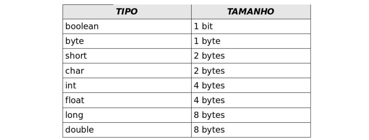

# Capítulo 3: Variáveis Primitivas

Uma variável primitiva se difere da variável para objetos. A variável primitiva realmente armazena o valor que lhe atribuimos. A váriavel para criar um objeto não armazena o objeto criado, mas faz uma referência a este objeto.

## Casting

Casting (moldagem) é o ato de converter o tipo de uma variável. **Não é um método**, mas um operador de conversão de tipo, é uma instrução que diz ao compilador para mudar o tipo de uma variável em específico.

```Java
class Main{
    public static void main(String[] args){
        double value = 5.234;

        System.out.println("Antes do casting: "+value);
        System.out.println("Após o casting: "+(int) value); // converte o value para int antes de printar
    }
}
```

ou

```Java
class Main{
    public static void main(String[] args){
        double value = 5.234;
        int valueCasted = (int) value; // converte o value para int e salva em valueCasted
        
        System.out.println("Antes do casting: "+value);
        System.out.println("Após o casting: "+valueCasted);
    }
}
```

Resultado:

```
Antes do casting: 5.234
Após o casting: 5
```

**Não é necessário fazer o cast quando se quer armazenar o valor de uma variável do tipo `int` em uma variável do tipo `double` pois todo inteiro cabe dentro de double, é feita uma conversão automática pelo compilador. O mesmo vale para as outras variáveis. Só é necessário o cast quando deseja armazena o valor de uma variável em que o tipo é maior do que o tipo da variável que irá receber.**

## Tipo e Tamanho das Variáveis Primitivas no Java



## Operador de Incremento

`i++` e `++i` tem suas diferenças.

### Primeira maneira (i++)

```Java
class Main{
    public static void main(String[] args){
        int firstValue = 3;
        int secondValue = firstValue++;

        System.out.println("Primeiro valor: "+firstValue);
        System.out.println("Segundo valor: "+secondValue);

    }
}
```

Resultado:

```
Primeiro valor: 4
Segundo valor: 3
```

### Segunda maneira (++i)

```Java
class Main{
    public static void main(String[] args){
        int firstValue = 3;
        int secondValue = ++firstValue;

        System.out.println("Primeiro valor: "+firstValue);
        System.out.println("Segundo valor: "+secondValue);
    }
}
```

Resultado:
```
Primeiro valor: 4
Segundo valor: 4
```

### Explicando

```Java
int firstValue = 3;
int secondValue = firstValue++;
```

**Isso diz:**

1. armazene o valor da variável `firstValue` em `secondValue`;
	- ou seja, armazene o valor 3 em `secondValue`;
2. depois some mais 1 em `firstValue`;
	- ou seja, some mais 1 ao valor 3, passando para 4, e salve em `firstValue`;
	
---

```Java
int firstValue = 3;
int secondValue = ++firstValue;
```

**Isso diz:**

1. some mais um em `firstValue`;
	- ou seja, 3+1=4, `firstValue` passa a valer 4;
2. depois armazene o valor de `firstValue` em `secondValue`;
	- `secondValue` passa a ter o valor 4 também;